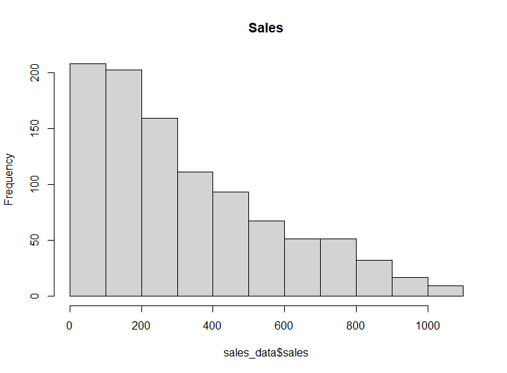
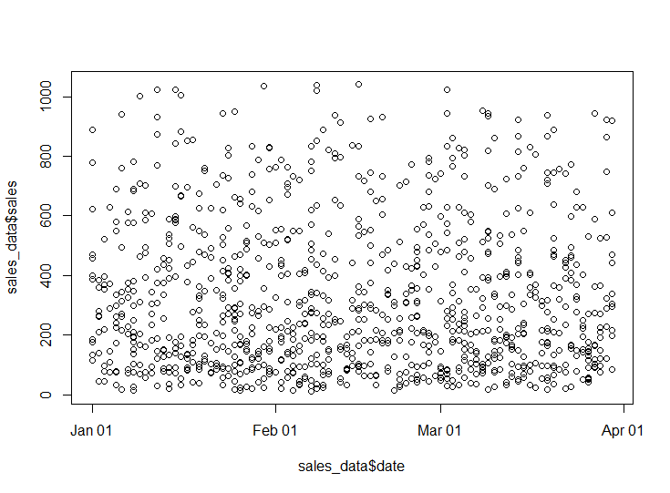

# **Anomally Detection**
# **Defining the Research Problem**
### **Defining the Question**
I am a data analyst at Carrefour. It is a supermarket company that has various outlets across the globe and I have been tasked with the work of formulating a suitable marketing strategy that will help in maximizing the profits of the company. I have been provided with dataset of sales from different branches. I am too do my analysis and provide appropriate recommendations.

Goal - Confirm presence or absence of anomalies

### **Defining the metric for success**
Determining presence or absence of anomalies.

### **Recording the experimental design**
Below are the stages that I am going to follow:

1. Data reading and checking
2. Data tidying
3. Exploratory Data Analysis
4. Implementation of solution
5. Data Relevance

### **Relevance of Data**
The data provided is from the companies collection and it will be relevant or our analysis.

## **Data Reading and Checking**
```R
#libraries
library(tibbletime)
library(tidyverse)
library(anomalize)


#loading our dataset and previewing it
sales_data <- fread("http://bit.ly/CarreFourSalesDataset")
head(sales_data)
```
It is a dataset containing dates and sales.

## **Data Tidying**
```R
#changing column names to lowercase
names(sales_data) <- tolower(names(sales_data))

#checking for column datatypes
str(sales_data)

#changing the date datatype
sales_data$date <- as.Date(sales_data$date, format = "%m/%d/%Y")
```

## **Exploratory Data Analysis**
```R
#histogram
hist(sales_data$sales, main="Sales")
```


 - Most sales are in the lower range.
```R
#sactterplot
plot(sales_data$date, sales_data$sales)
```
 - There seem to be no relation between the two.

## **Implementing Solution**

## **Anomally Detection**

```R

#grouping the data 
sales_data_days <- sales_data %>% group_by(date) %>% summarise_all(sum) %>% as_tbl_time(date)

dim(sales_data_days)

#detecting our anomalies.
sales_data_days %>%
    time_decompose(sales) %>%
    anomalize(remainder) %>%
    time_recompose() %>%
    plot_anomalies(time_recomposed = TRUE, ncol = 3, alpha_dots = 0.5)

```
We don't have any anomalies in view

## **Conclusion**
 - We have no anomalies in the dataset. This shows that there is a secure system that is preventing such from happening.