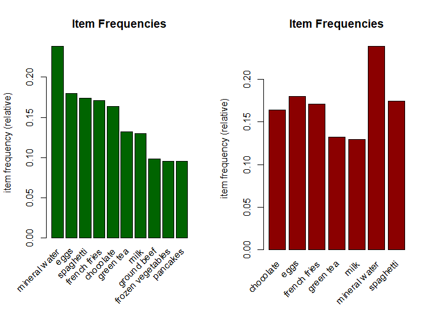

# **Association Rules**
# **Defining the Research Problem**
### **Defining the Question**
I am a data analyst at Carrefour. It is a supermarket company that has various outlets across the globe and I have been tasked with the work of formulating a suitable marketing strategy that will help in maximizing the profits of the company. I have been provided with dataset of sales from different branches. I am to do my analysis and provide appropriate recommendations.

Goal - Confirm presence or absence of anomalies

### **Defining the metric for success**
Determining presence or absence of anomalies.

### **Recording the experimental design**
Below are the stages that I am going to follow:

1. Data reading and checking
2. Implementation of solution
3. Conclusion.

### **Relevance of Data**
The data provided is from the companies collection and it will be relevant or our analysis.

## **Data Reading and Checking**
```R
#libraries
install.packages("arules")
library(arules)

#loading and previewing dataset
sales_dataset <- read.transactions("http://bit.ly/SupermarketDatasetII", sep=",")

inspect(sales_dataset[1:10])
```
```R
#checking the dimensions
dim(sales_dataset)
```

```R
summary(sales_dataset)
```
Frequently bought items
 - Mineral water
 - Eggs
 - Spaghetti
 - French Fries
 - Chocolate

```R
#viewing the items in our transactions
itemLabels(sales_dataset)
```
```R
itemFrequency(sales_dataset[, 5:10],type = "absolute")
```

```R
#plotting the items with the thresholds specified.
par(mfrow = c(1, 2))
itemFrequencyPlot(sales_dataset, topN = 10,col="darkgreen", main="Item Frequencies")
itemFrequencyPlot(sales_dataset, support = 0.1,col="darkred", main="Item Frequencies")
```

```R
#Finding different rules by tunin the confidence an support thresholds.
rules_1 <- apriori (sales_dataset,parameter = list(supp = 0.001, conf = 0.9)) 
rules_1
#11 Rules

rules_2 <- apriori (sales_dataset,parameter = list(supp = 0.002, conf = 0.8)) 
rules_2
#2 Rules

rules_3 <- apriori (sales_dataset,parameter = list(supp = 0.001, conf = 0.8)) 
rules_3
#74 Rules

rules_4 <- apriori (sales_dataset,parameter = list(supp = 0.001, conf = 0.7)) 
rules_4
#200 Rules

rules_5 <- apriori (sales_dataset,parameter = list(supp = 0.002, conf = 0.8)) 
rules_5
#2 Rules

```
 - rules_4 has 200 rules.
 - We are goint to check this one out.

```R
inspect(rules_4[1:5])
```

```R
#ordering the rules using the confidence.
rules_4<-sort(rules_4, by="confidence", decreasing=TRUE)
inspect(rules_4[1:10])
```
 - The first rule here states that if one one buys french fries, mushroom cream sauce and pasta, they are most probably going to buy escalope.

```R
#creating a rule subset for a commodity and arranging by confidence to evaluate the commodity
milk <- subset(rules_4, subset = rhs %pin% "milk")

milk<-sort(milk, by="confidence", decreasing=TRUE)
inspect(milk[1:5])
```
 - Cake, meatballs and mineral water are often bought before milk.

```R
#creating a rule subset for a commodity and arranging by confidence to evaluate the commodity
escalope <- subset(rules_4, subset = rhs %pin% "escalope")

escalope <- sort(escalope, by="confidence", decreasing=TRUE)
inspect(escalope)
```
 - Mushroom cream sauce and pasta are bought before buying escalope.

```R
#creating a rule subset for a commodity and arranging by confidence to evaluate the commodity
shrimp <- subset(rules_4, subset = rhs %pin% "shrimp")

shrimp<-sort(shrimp, by="confidence", decreasing=TRUE)
inspect(shrimp)
```
 - People purchase pasta before buying shrimp.

## **Conclusion**
 - Promotions could be done on pasta and shrimp or the commodities arranged close to each other.
 - Mushroom cream sauce, pasta and escalope could be placed on the same shelf.
 - Cake and mineral water could be placed near milk.
 