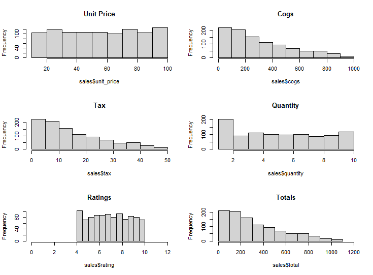

# **Dimensionality Reduction and Feature Selection**

# **Defining the Research Problem**
## **Defining the Question**
I am a data analyst at Carrefour. It is a supermarket company that has various outlets across the globe and I have been tasked with the work of formulating a suitable marketing strategy that will help in maximizing the profits of the company. I have been provided with dataset of sales from different branches. I am too do my analysis and provide appropriate recommendations.

Goal - Reduce the dataset and choose efficient features for use in later modeling.

## **Defining the metric for success**
Successful reduction of dataset and determinative feature selection.

## **Recording the experimental design**
Below are the stages that I am going to follow:

1. Data reading and checking
2. Data tidying
3. Exploratory Data Analysis
4. Implementation of solution
5. Conclusion

## **Relevance of Data**
The data provided is from the companies collection and it will be relevant or our analysis.

```R
#loading the appropriate libraries
library(data.table)
library(tidyverse)
library(readr)
library(psych)
library(corrplot)
library(Hmisc)
library(caret)
```
## **Data Loading and Checking.**
```R
#loading and previewing the data
sales <- fread("http://bit.ly/CarreFourDataset")
head(sales)
```
```R
#checking for dimensions
dim(sales)
```
1000 rows and 16 columns

```R
#checking for column names
colnames(sales)
```
```R
#checking for datatypes
str(sales)
```
```R
#getting a numerical summary of the columns
summary(sales)
```

## **Data Cleaning.**
```R
#checking for duplicates
anyDuplicated(sales)
```
No duplicates in the data
```R
#checking for null values
sum(is.na(sales))
```
No null values.
```R
#checking for missing values
sales[!complete.cases(sales),]
```
No missing values in the columns
```R
#changing column names to lowercase
names(sales) <- tolower(names(sales))

#changing column names.
setnames(sales, old = c("invoice id", "customer type", "product line", "unit price", "gross margin percentage", "gross income"), new = c("invoice_id" ,"customer_type", "product_line", "unit_price", "gross_margin_%", "gross_income"))

#changing date colmn to data datatype
sales$date <- as.Date(sales$date, format = "%m/%d/%Y")

#verifying the calculated fields
sum(sales$total != (sales$cogs + sales$tax))
#252 totals are not the same as the sum of the cogs and the tax

sum(sales$cogs != (sales$unit_price * sales$quantity))
#173 cogs values arent the same as the multiplication of the unit price and the quantity.

#we will take care of the above two columns
sales$cogs <- sales$unit_price * sales$quantity
sales$total <- sales$cogs + sales$tax

sum(sales$cogs != (sales$unit_price * sales$quantity))
sum(sales$total != (sales$cogs + sales$tax))

#checking for the change
str(sales)
numerical.columns <- select(sales, 'unit_price', 'quantity', 'tax', 'cogs', 'gross_margin_%', 'gross_income', 'rating', 'total')
```
```R
describe(numerical.columns)
```
From our description, the gross margin percentage column has only one distinct value. We will remove the whole column since it doesnt provide a varse insight to our dataset. 
We can also see that the tax and the gross income are of the same values all through. We will look deeper into this.
```R
#dropping columns
sales <- sales[,-c(13)]
numerical.columns <- numerical.columns[,-c(5)]

boxplot(numerical.columns)

sum(sales$tax != sales$gross_income)

```
The cogs and total columns have few outliers. We will leave these since they are calculated fields and they depend on the unit price and quantity columns which do not seen to have any outliers
I have also confirmed the similatity between the tax and gross income columns. I will thus remove one of them.

```R
sales <- sales[,-c(13)]
head(sales)
```

## **Exploratory Data Analysis.**
```R
#plotting the appropriate histograms
par(mfrow=c(3,2))
hist(sales$unit_price, main="Unit Price")
hist(sales$cogs, main="Cogs")
hist(sales$tax, main="Tax")
hist(sales$quantity, main="Quantity")
hist(sales$rating, main="Ratings", xlim = c(0,12))
hist(sales$total, main="Totals", xlim = c(0,1200))

```


From the above plots, we can derive the following.
 - The unit prices are distributed a bit evenly.
 - Cogs is rightly skewed, showing more people spend less on shopping.
 - Tax too is rightly skewed which is a reflection of the cogs column.
 - People tend to buy commodities in low quantities.
 - The ratings are evenly distributed with a peak between 4 and 4.25.
 
```R
totals_in_branches <- sales %>% select(total, branch)%>%group_by(branch)%>% summarise_all(sum)

totals_in_branches[order(totals_in_branches$total, decreasing = TRUE),]
```
Branch C had the highest sales overally

```R
totals_in_payments <- sales %>% select(total, payment)%>%group_by(payment)%>% summarise_all(sum)

totals_in_payments[order(totals_in_payments$total, decreasing = TRUE),]
```
Cash was the highest mode of payment

```R
totals_in_customers <- sales %>% select(total, customer_type)%>%group_by(customer_type)%>% summarise_all(sum)

totals_in_customers[order(totals_in_customers$total, decreasing = TRUE),]
```
Members are the customers that did the most shopping.

```R
totals_in_gender <- sales %>% select(total, gender)%>%group_by(gender)%>% summarise_all(sum)

totals_in_gender[order(totals_in_gender$total, decreasing = TRUE),]
```
Females did more shopping compared to male.

```R
totals_in_products <- sales %>% select(total, product_line)%>%group_by(product_line)%>% summarise_all(sum)

totals_in_products[order(totals_in_products$total, decreasing = TRUE),]
```
Commodities in the food and beverage line were the most bought items.

```R
#finding correlations between the columns
corr_matrix <- cor(numerical.columns)
view(corr_matrix)
```

## **Implementing Solution.**

### **Dimensionality Reduction**

**PCA**
```R
#duplicating a new dataset for use
sales.1 <- sales

#changing categorical variables to numerical values
sales.1$branch <- as.numeric(sapply(sales.1$branch, mapvalues,from = c("A", "B", "C"),to = c(1, 2, 3)))
sales.1$customer_type <- as.numeric(sapply(sales.1$customer_type, mapvalues,from = c("Member", "Normal"),to = c(1, 0)))
sales.1$gender <- as.numeric(sapply(sales.1$gender, mapvalues,from = c("Female", "Male"),to = c(1, 2)))
unique(sales$product_line)
sales.1$product_line <- as.numeric(as.factor(sales.1$product_line))
sales.1$payment <- as.numeric(sapply(sales.1$payment, mapvalues,from = c("Cash", "Ewallet", "Credit card"),to = c(1, 2, 3)))
sales.1$quantity <- as.numeric(sales.1$quantity)

str(sales.1)

```

```R
#creating a dataset for perfomance of pca by removing categorical variables and the ones we dont need.
#total is also removed since its what we would like to predict.
sales.1.pca <- sales.1[,-c(1:5, 9:11, 14)]
str(sales.1.pca)

```

```R
#perfoming pca using prcomp and viewing the summary of the pca.
sales.pca <- prcomp(sales.1.pca, center = TRUE, scale. = TRUE)
summary(sales.pca)
```
 - We can see that PC1 has a variance percentage contribution of 58.7%. PC2 accounts for 20% while PC3 accounts for 20% too.
 
```R
str(sales.pca)
```
We can see that unit price, quantity and tax contribute a lot to the total price.
```R
#visualizing the pca perfomance.
ggbiplot(sales.pca, groups=sales$branch, ellipse=TRUE)
```


### **Feature Selection**
```R
library(caret)
```

```R
#getting columns with correlation above 0.80
high_corr <- findCorrelation(corr_matrix, cutoff=0.8)

high_corr
```
```R
#checking for the highly correlated columns
colnames(numerical.columns[,c(3,4)])
#tax and cogs are the highly correlated columns(features.)
```

## **Conclusion**
 - Unit price, quantity and tax are the three variables that contribute most to change in the total sale.
 - Tax and cogs are highly related. This can be explained since tax is determined as a percentage of the cogs.
